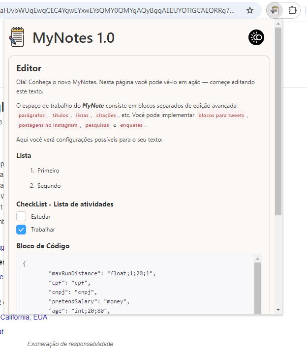

# Bloco de Notas MyNotes - Extensão do Chrome
---

O My Notes é uma extensão prática do Google Chrome que traz a facilidade de um bloco de notas rápido com poderosas funcionalidades. através dele é possível organizar suas ideias, tarefas e lembretes com ferramentas avançadas, como checklists e edição de texto rica. Inclui também modo escuro para uma experiência personalizável e confortável em qualquer ambiente.

## Funcionalidades
---

- **Checklists**: Crie listas de tarefas e marque os itens concluídos.
- **Edição de Texto Avançada**: Formate suas anotações com ferramentas de edição de texto, como negrito, itálico, sublinhado, listas ordenadas, títulos e muito mais.
- **Listas**: Organize suas ideias com listas personalizadas.
- **Blocos de código**: Estilize seu código em blocos separadamento do texto.
- **Rápido e Intuitivo**: Design intuitivo e simples, permitindo que você tome notas em segundos.
- **Dark Mode**: Ative o modo escuro para uma experiência mais confortável em ambientes com pouca luz.
- **Modo Offline**: Utilização em modo offline para que os usuários possam criar e editar anotações sem uma conexão à internet.

## Instalação
---

1. Realize o download ou clone o repositório no seu computador.
2. Abra o **Google Chrome** e vá até `chrome://extensions/`.
3. Ative o **Modo de desenvolvedor** no canto superior direito.
4. Clique em **Carregar sem compactação** e selecione a pasta do projeto.
5. A extensão será adicionada e o ícone estará disponível na barra de ferramentas do Google Chrome.

## Como Usar
---

1. Clique no ícone da extensão na barra de ferramentas do Chrome.
2. Crie suas anotações rapidamente, utilizando as ferramentas disponíveis:
   - **Checklists** para tarefas
   - **Edição de texto avançada** para formatação

3. Para alternar entre o modo claro e o modo escuro, clique no botão de alternância no canto superior direito da extensão.
4. Suas notas serão salvas automaticamente enquanto você escreve.

## Capturas de Tela
---
**

## Tecnologias Utilizadas
---

- **HTML5**: Estrutura básica da extensão.
- **CSS3**: Estilos visuais.
- **JavaScript**: Lógica e funcionalidades dinâmicas.
- **Chrome API**: Integração com o navegador.
- **Editor.js**: biblioteca JavaScript para editor de textos ricos.
## Melhorias Futuras 
---

- **Inserção de Imagens**: Adicionar imagens às suas anotações para maior clareza.
- **Exportação para PDF/Markdown**: Oferecer a possibilidade de exportar anotações em diferentes formatos como PDF, Markdown, ou TXT.
- **Suporte para notificações e lembretes**: Adicionar notificações e lembretes baseados em datas ou horários definidos pelo usuário para tarefas criadas no MyNotes.
- **Anotações com Senha ou Criptografia**: Oferecer a opção de proteger anotações específicas com senha ou criptografia para aumentar a segurança dos dados. 
- 

## Licença
---

Este projeto está licenciado sob a licença MIT - veja o arquivo [LICENSE](LICENSE) para mais detalhes.

---